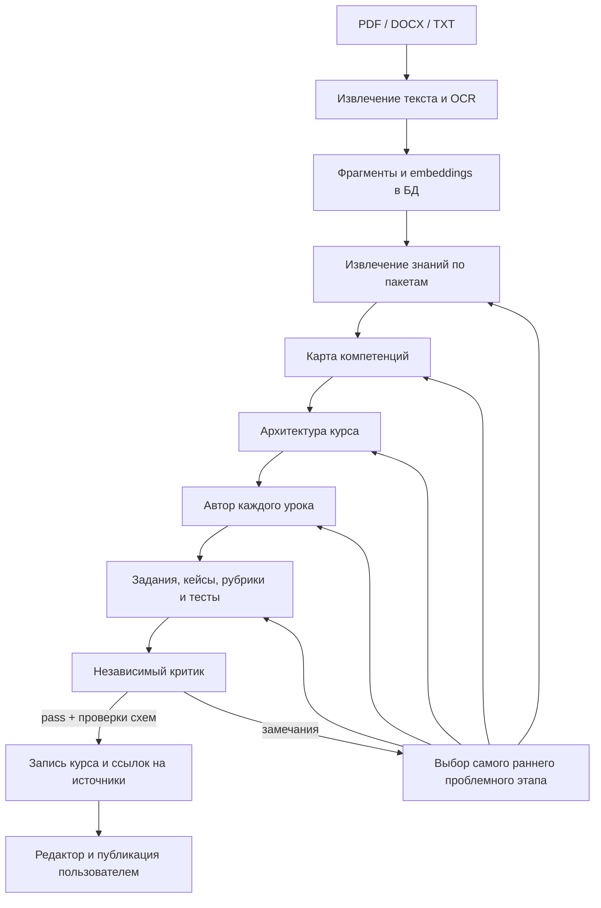

# AI-система Лерниум

## Что реализовано

Генерация курса выполняется графом LangGraph. Каждый узел вызывает специализированного
агента через LangChain `ChatOpenAI` и VSELLM, возвращает типизированный артефакт и проходит
проверки Python. Результат записывается в структуру курса только после успешного QA.



`app/services/agentic_course_pipeline.py` содержит граф; `app/ai/` — модели,
транспорт, хранилище состояния, поиск, память и разделение контекста на пакеты.
Промты находятся в `app/prompts/`, контракты — в `app/schemas/agentic_pipeline.py`.

## Модели и роли

| Агент | Модель по умолчанию | Задача |
|---|---|---|
| Ingestion | `openai/gpt-5.4-mini` | Извлечь явные факты, требования и процедуры с цитатами |
| Competency Mapper | `openai/gpt-5.4-mini` | Связать роли, компетенции, навыки, знания и процедуры |
| Course Architect | `openai/gpt-5.4-mini` | Составить цели, модули, предпосылки и точное число уроков |
| Lesson Writer | `openai/gpt-5.4-mini` | Написать отдельный урок по его целям и найденным источникам |
| Assessment | `openai/gpt-5.4-mini` | Подготовить задания, кейсы, критерии оценивания и ответы |
| Critic / QA | `anthropic/claude-sonnet-4.6` | Проверить факты, полноту, сложность и качество заданий |
| Update | `openai/gpt-5.4-mini` | Предложить изменения при появлении новой версии документа |
| Chat | `openai/gpt-5.4-mini` | Ответить с историей диалога и материалами выбранного курса |
| Memory | `openai/gpt-5.4-mini` | Сжать старую историю, сохранив решения и ограничения |
| Canvas | `openai/gpt-5.4-mini` | Предложить изменения выделенной части рабочей схемы |
| Embeddings | `openai/text-embedding-3-small` | Построить векторы для поиска по документам |

Общая резервная текстовая модель — `google/gemini-2.5-flash`. Для карты компетенций,
плана, заданий, Update и Canvas резервом служит модель критика; если она совпадает
с основной, выбирается быстрая модель. Переменные `AI_MODEL_*` позволяют менять
профиль без правок графа. Модели вне профиля сервер не принимает.
После ошибки схемы агент сначала исправляет ответ на основной модели; после
временной ошибки сервиса или на последней попытке используется резерв.

Профиль выбран по небольшим живым прогонам через предоставленный VSELLM-ключ.
DeepSeek V3.2 исключён из маршрута по умолчанию после повторных таймаутов.
Это проверенный начальный профиль, а не доказательство оптимальности для любого
предмета и тарифа. Смена модели требует повторного прогона оценок качества.

## Проверки и восстановление

- Pydantic проверяет форму JSON, уникальность ID, ссылки между артефактами,
  отсутствие циклов предпосылок, покрытие целей, состав ответов и рубрик.
- Модель возвращает ID источников. Цитаты, версии, хеши и номера фрагментов
  прикрепляет сервер; неизвестная или изменённая ссылка отклоняется.
- Обрабатываются все фрагменты принятого корпуса. Превышение лимита вызывает
  явную ошибку, без молчаливого отбрасывания конца документа.
- Writer получает отдельное задание на урок. Assessment и QA работают пакетами
  не более двух уроков; каждый QA-пакет получает все цитируемые им источники.
- `pass` требует отсутствия блокирующих замечаний и всех четырёх оценок не ниже
  `AI_QA_MIN_SCORE`. Проверка качества моделью дополняет проверки структуры.
- Замечания возвращают граф на соответствующий этап. По умолчанию разрешены
  две итерации исправления; после этого запуск завершается ошибкой.
- LangGraph сохраняет состояние после каждого узла. PostgreSQL использует
  отдельную схему `lernium_ai_graph`, SQLite — файл контрольных точек.
- Изменение моделей, промтов, схем или реализации графа меняет ключ состояния.
  Повторный запуск не принимает результат старой реализации за новый.
- Временные ошибки получают ограниченные повторы с задержкой. RQ может
  повторить тот же запуск, продолжив его контрольную точку.

## Кеш, память и поиск

**Кеш артефактов.** `ai_response_cache` хранит только проверенные ответы на 24 часа.
Ключ включает владельца, курс, модель, шаблон, схему и входные данные. Изменение
документа или настроек меняет ключ. Просроченные записи очищаются при обращении
к AI. Артефакты текущего запуска дополнительно хранятся в `agent_artifacts`.

**Поиск.** Embeddings сохраняются в `chunk_embeddings` вместе с моделью и хешем
текста. Повторная индексация неизменённого фрагмента использует сохранённый вектор.
Поиск объединяет лексическое ранжирование и близость векторов. При недоступности
embeddings остаётся лексический поиск. Права доступа проверяются по БД до поиска
и повторно при формировании ответа. Перезапуск web/worker не обнуляет индекс.

**Память.** `chat_memory` принадлежит одному владельцу и диалогу. Старая история
сжимается по числу сообщений и объёму контекста; новые сообщения сохраняются
дословно. Сводка передаётся как недоверенные данные, отдельно от системной роли.
Для диалога с `course_id` ответы дополняются найденными фрагментами курса.

**Рабочая канва.** `canvas_workspaces` хранит пользовательскую схему на сервере.
Версия защищает от перезаписи из другой вкладки: устаревшее сохранение даёт 409.
AI-действия требуют выбранные узлы и цитаты источников. Канва хранит предложения;
публикуемое содержание уроков редактируется в редакторе курса.

## Лимиты и наблюдаемость

| Переменная | По умолчанию |
|---|---:|
| `AI_REQUEST_TIMEOUT_SECONDS` | 90 |
| `AI_MAX_ATTEMPTS` | 3 |
| `AI_MAX_CALLS_PER_RUN` | 180 |
| `AI_MAX_TOKENS_PER_RUN` | 600000 |
| `AI_MAX_INPUT_TOKENS` | 64000 |
| `AI_MAX_SOURCE_CHARS` | 500000 |
| `AI_INGESTION_BATCH_CHARS` | 10000 |
| `AI_MAX_REVISIONS` | 2 |
| `AI_QA_MIN_SCORE` | 0.8 |
| `AI_JOB_TIMEOUT_SECONDS` | 3600 |
| `AI_OCR_MAX_PAGES` | 30 |

Перед вызовом резервируется верхняя оценка расхода: число UTF-8 байтов входа
плюс лимит выхода. После ответа резерв заменяется фактическим `usage` провайдера.
Для оборванного запроса резерв остаётся списанным, поскольку точный расход неизвестен.
Такой консервативный расчёт не загружает токенизатор из сети во время работы.

`GET /api/generation-runs/{id}/usage` возвращает модели, попытки, токены,
время и коды ошибок. `GET /api/generation-runs/{id}/artifacts` — артефакты агентов.
Оба маршрута доступны только владельцу. Ключ и сырые ошибки провайдера не попадают
в эти ответы. Денежная стоимость не подменяется оценкой: `cost_usd` остаётся пустым,
если нет подтверждённого расчёта по тарифу. Embeddings, чат и канва не входят
в бюджет генерации курса; у них ограничены размеры отдельных запросов.

## Локальный запуск

```bash
cd ciBack
python scripts/configure_local.py --credentials ../creeds
docker compose up --build -d

cd ../ciFront
npm ci
npm run dev
```

Скрипт конфигурации создаёт/обновляет игнорируемый `.env` с правами `0600`, не
выводит ключ и сохраняет существующие настройки БД. Ключ нужен только backend.
В Docker установлены Tesseract и языки `rus`/`eng`; сканированные PDF распознаются
при отсутствии текстового слоя. PyTorch не нужен для стандартного профиля.
Локальные sentence-transformers доступны отдельно через
`requirements-local-embeddings.txt`.

Для развёртывания используется миграция `20260915_0015`; web и worker должны
работать с одной БД и общим каталогом загрузок. Проверка контрольных точек
добавлена в существующий CI. Рабочие файлы ключа исключены из Git и Docker-контекста.

## Проверка

```bash
cd ciBack
uv venv --python 3.11 .venv
uv pip install --python .venv/bin/python -r requirements-dev.txt
.venv/bin/python -m pytest -q

# Только на отдельной тестовой БД, без платных вызовов:
DATABASE_URL=sqlite:///:memory: AI_CHECKPOINT_SQLITE_PATH=/tmp/lernium-checkpoints-test.sqlite ENV=test DEBUG=false VSELLM_API_KEY= .venv/bin/python scripts/check_ai_persistence.py

# Живой прогон: платные вызовы VSELLM, только синтетические документы.
.venv/bin/python scripts/evaluate_ai.py --credentials ../creeds --lessons 4 --output /tmp/ai-evaluation.json

cd ../ciFront
npm run build
npm run lint
npm test -- --run
```

Живой сценарий проверяет embeddings, поиск, генерацию, QA, материализацию,
ссылки на источники и публикацию в изолированной временной SQLite-БД. Рабочие
курсы пользователя не меняются. Результаты проверки описаны в `AI_VALIDATION.md`.

## Практические границы

- Проверены синтетические сценарии и главы одного реального учебника. Прогон
  учебника не прошёл QA; обнаружены ошибка курса и ложные блокировки критика.
  Для измерения качества нужны дополнительные корпуса с эталонными фактами,
  целями и заданиями; высокий балл критика сам по себе не доказывает точность.
- 500000 символов — предел принимаемого корпуса, а не обещание, что любой такой
  корпус поместится в контекст карты компетенций и планировщика. При превышении
  контекста или бюджета материалы нужно разделить на курсы.
- Векторный поиск сейчас сканирует доступные векторы курса в БД. Для большого
  каталога нужен индекс pgvector/HNSW и нагрузочные измерения.
- OCR извлекает текст; понимание схем, сложных таблиц и формул отдельным
  мультимодальным агентом не реализовано.
- Сводка памяти может потерять детали. Это не хранилище юридически значимых
  требований; источником фактов остаются документы и исходные сообщения.
- Канва и предложения Update Agent не публикуют изменения самостоятельно.
- Лимит токенов на курс не заменяет общий лимит расходов организации. Общий
  бюджет чата/канвы, нагрузочные квоты и эксплуатационный мониторинг требуют
  настройки перед массовым использованием.

## Основания интеграции

- [VSELLM API: Chat Completions и Embeddings](https://vsellm.ru/docs).
- [LangGraph: хранение состояния и контрольные точки](https://docs.langchain.com/oss/python/langgraph/persistence).
- [LangGraph: графы и управление выполнением](https://docs.langchain.com/oss/python/langgraph/overview).

## Проверка на учебнике

Реальный прогон на математическом PDF выявил ограничения извлечения формул,
ложные срабатывания QA и большой объём повторной работы после замечаний.
Курс остался черновиком. Результаты и воспроизводимые команды:
[AI_REAL_MATERIALS.md](AI_REAL_MATERIALS.md).
